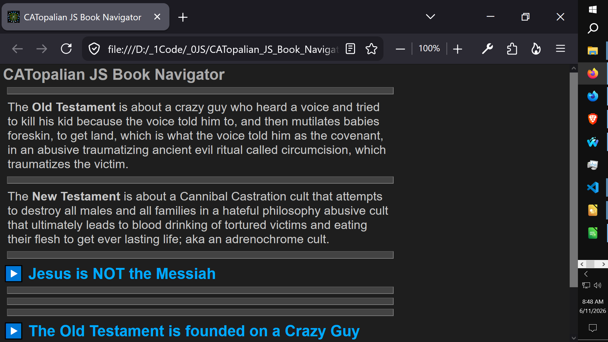
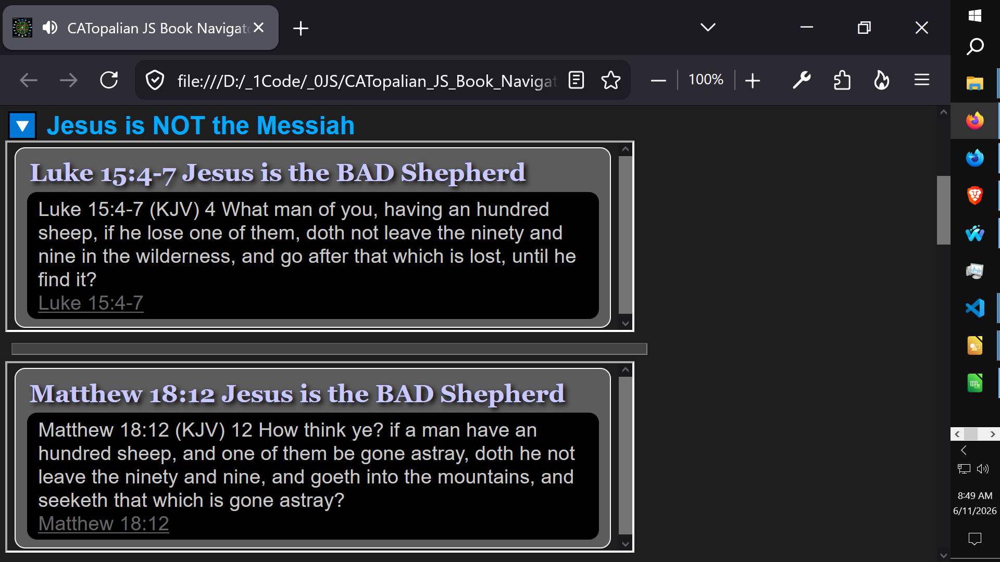

# CATopalian JS Book Navigator
An JavaScript app that makes studying ancient and modern books very organized and easy. 

---

Use App: https://christopherandrewtopalian.github.io/CATopalian_JS_Book_Navigator/CATopalian_JS_Book_Navigator.html

---

## **Dedicated to God the Father**

## Author

**Christopher Andrew Topalian**
© 2000-2026 All Rights Reserved

- GitHub: [https://github.com/ChristopherAndrewTopalian](https://github.com/ChristopherAndrewTopalian)

- GitHub: [https://github.com/ChristopherTopalian](https://github.com/ChristopherTopalian)
- College of Scripting Music & Science: [https://sites.google.com/view/CollegeOfScripting](https://sites.google.com/view/CollegeOfScripting)

